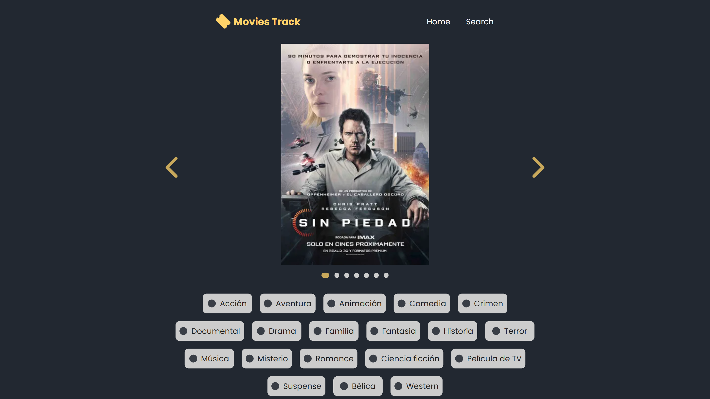
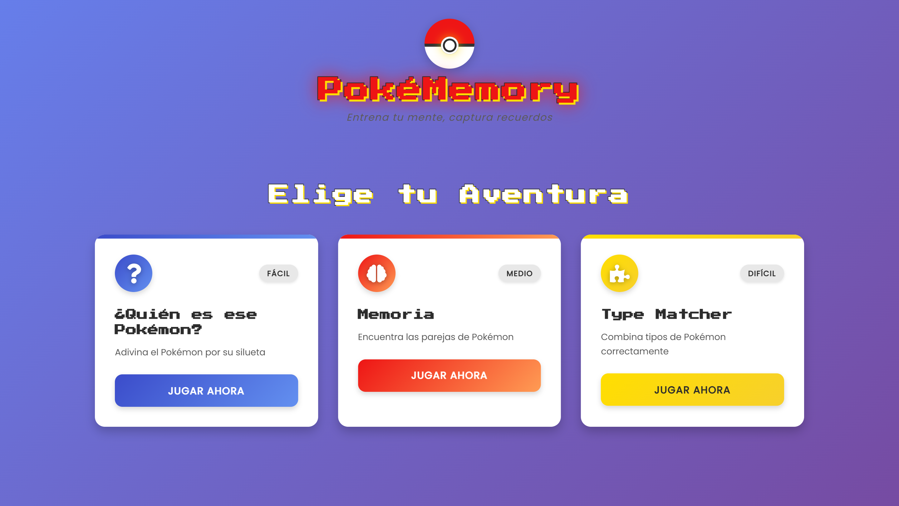

<div align="center">

<!-- Banner animado -->

</div>

---

## 👨‍💻 Sobre mí

```typescript
const developer = {
  nombre:      "Marco Moya",
  rol:         "Frontend Developer",
  ubicación:   "México 🇲🇽",
  enfoque:     ["UI/UX", "Web Performance", "Accesibilidad"],
  actualmente: "Construyendo interfaces que enamoran 🚀",
  disponible:  true
};
```

---

## 🛠️ Stack Tecnológico

<div align="center">

### 🎨 Frontend Core


### ⚛️ Frameworks & Librerías


### 🎨 Estilos & UI


### 🧰 Herramientas


</div>

---

## 🚀 Proyectos Destacados

<div align="center">
<table>
<tr>
<td width="50%">

<h3 align="center">🛒 Tienda Adidas</h3>
<div align="center">
<a href="https://github.com/marco-moya/ebac-code-together" target="_blank">

</a>
<p>
<a href="https://github.com/marco-moya/ebac-code-together" target="_blank">

</a>
<a href="https://marco-moya.github.io/ebac-code-together" target="_blank">

</a>
</p>
<p>Tienda online de productos deportivos Adidas, desarrollada como práctica del curso EBAC Code Together.</p>
<p>


</p>
</div>

</td>
<td width="50%">

<h3 align="center">🎬 Movies Track</h3>
<div align="center">
<a href="https://github.com/marco-moya/movie-catalog" target="_blank">

</a>
<p>
<a href="https://github.com/marco-moya/movie-catalog" target="_blank">

</a>
<a href="https://moviestrack.netlify.app/index.html" target="_blank">

</a>
</p>
<p>Catálogo y buscador de películas que permite a los usuarios explorar películas en tendencia.</p>
<p>


</p>
</div>

</td>
</tr>
<tr>
<td width="50%">

<h3 align="center">🎮 Pokememory Game</h3>
<div align="center">
<a href="https://github.com/marco-moya/Pokememory-game" target="_blank">

</a>
<p>
<a href="https://github.com/marco-moya/Pokememory-game" target="_blank">

</a>
<a href="https://pokemon-juegos.netlify.app/" target="_blank">

</a>
</p>
<p>Juego de memoria con temática Pokémon para poner a prueba tus habilidades.</p>
<p>


</p>
</div>

</td>
<td width="50%">

<h3 align="center">📚 EbookPro - Landing Page</h3>
<div align="center">
<a href="https://github.com/marco-moya/ebook-landing-page" target="_blank">

</a>
<p>
<a href="https://github.com/marco-moya/ebook-landing-page" target="_blank">

</a>
<a href="https://marco-moya.github.io/ebook-landing-page/" target="_blank">

</a>
</p>
<p>Landing page que ofrece más de 500 ebooks sobre desarrollo profesional, marketing digital, emprendimiento y tecnología.</p>
<p>


</p>
</div>

</td>
</tr>
</table>

</div>

---

## 🌐 Conéctate conmigo

<div align="center">

[]()
[](https://www.linkedin.com/in/marco-a-moya/)
[](mailto:marco.moyanar@gmail.com)

</div>

---

<div align="center">

<!-- Footer wave -->


*"El código es poesía que la máquina puede leer."*

</div>
